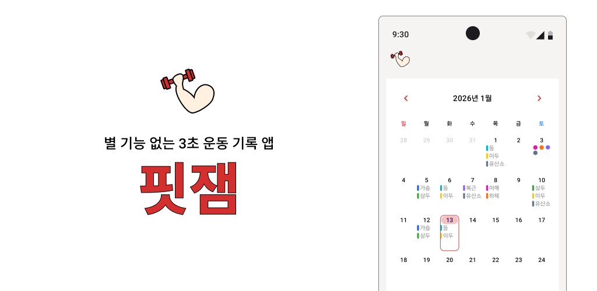
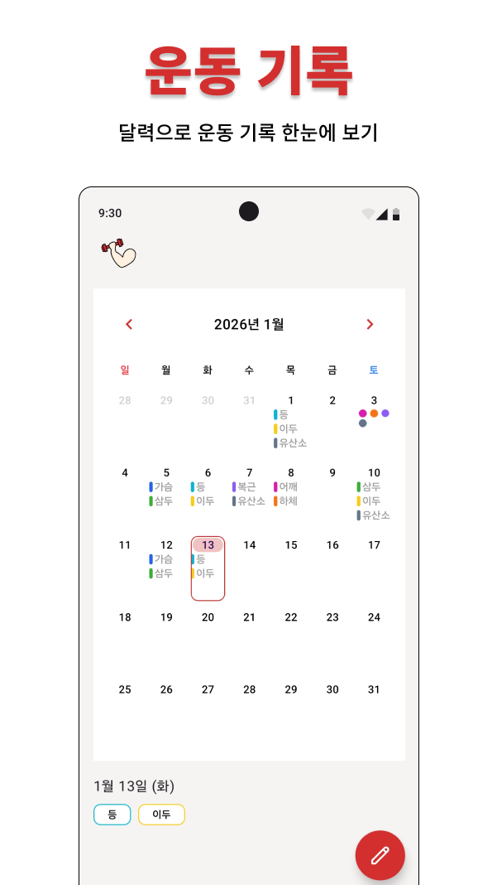
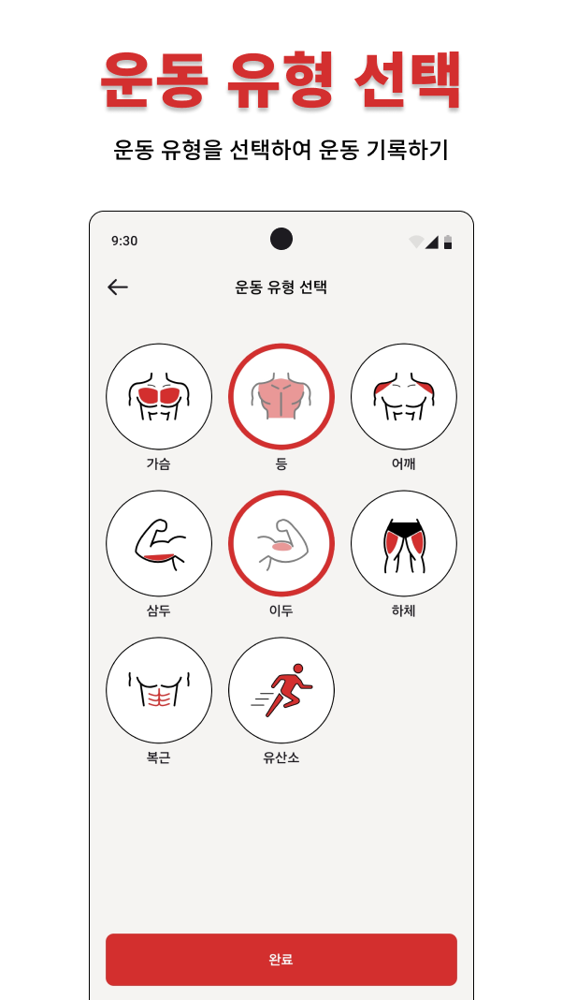

#  핏잼
**별 기능 없는 3초 운동 기록 앱**
<!-- 구글 플레이 스토어 링크 -->

## 기능
   

## 기술 스택

### Architecture
- MVVM

### Jetpack
- Android Architecture Component (AAC)
    - ViewModel
    - Navigation3
    - Room
- UI
    - Compose
- Dependency Injection
    - Hilt

### Etc
- Asynchronous
    - Coroutines
- Stream of Data
    - Flow
- Serialization
    - Serialization (kotlinx.serialization)
- Build Gradle
    - Kotlin DSL
    - Version Catalogs
- Min SDK 21