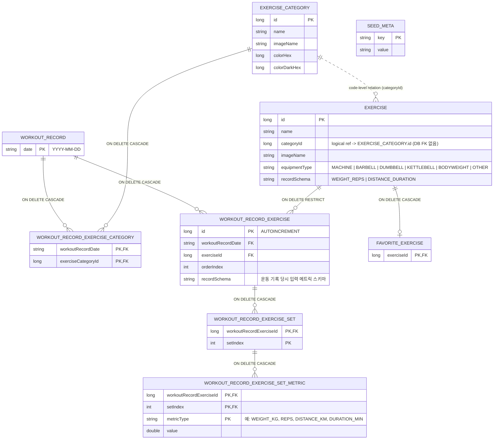

# Fitzam DB ERD

기준: Room DB `version = 5` (`FitzamDatabase`)

## 테이블 요약
- `workout_record`: 운동 기록 일자 마스터
- `workout_record_exercise_category`: 기록 일자별 운동 카테고리 매핑 (복합 PK)
- `workout_record_exercise`: 기록 일자별 운동 항목 (정렬 순서 포함)
- `workout_record_exercise_set`: 운동 항목별 세트 식별자 (복합 PK)
- `workout_record_exercise_set_metric`: 세트별 측정값(가변 메트릭) 저장
- `exercise_category`: 운동 카테고리 마스터
- `exercise`: 운동 종목 마스터 (`categoryId`는 DB FK 없이 코드 레벨 참조, `equipmentType`, `recordSchema` 포함)
- `favorite_exercise`: 즐겨찾기 운동 종목
- `seed_meta`: 시드 데이터 버전 메타 (`DefaultExerciseSeedManager`에서 생성/관리)

## 인덱스
- `workout_record_exercise(workoutRecordDate)`
- `workout_record_exercise(exerciseId)`
- `workout_record_exercise_set(workoutRecordExerciseId)`
- `workout_record_exercise_set_metric(workoutRecordExerciseId)`
- `workout_record_exercise_set_metric(workoutRecordExerciseId, setIndex)`

## 마이그레이션 메모
- `MIGRATION_1_2`:
  - 레거시 `workout`, `workout_category`, `workout_exercise`, `workout_set`를
    `workout_record*` 구조로 이전 후 삭제.
- `MIGRATION_2_3`:
  - `exercise.recordSchema` 컬럼 추가 (기본값 `WEIGHT_REPS`, 일부 종목 `DISTANCE_DURATION` 업데이트)
  - `workout_record_exercise_set`에서 기존 `weightKg`, `reps` 제거
  - `workout_record_exercise_set_metric` 테이블/인덱스 신설
- `MIGRATION_3_4`:
  - `workout_record_exercise.recordSchema` 컬럼 추가
  - 기존 기록의 메트릭 데이터를 기준으로 기록 당시 스키마 보정
- `MIGRATION_4_5`:
  - `exercise.equipmentType` 컬럼 추가
  - 운동명 기반으로 머신/바벨/덤벨/케틀벨/맨몸/기타 기본값 보정

## Source Files
- `app/src/main/java/com/jaemin/fitzam/data/source/local/FitzamDatabase.kt`
- `app/src/main/java/com/jaemin/fitzam/data/source/local/DatabaseMigrations.kt`
- `app/src/main/java/com/jaemin/fitzam/data/source/local/entity/WorkoutRecordEntity.kt`
- `app/src/main/java/com/jaemin/fitzam/data/source/local/entity/WorkoutRecordExerciseCategoryEntity.kt`
- `app/src/main/java/com/jaemin/fitzam/data/source/local/entity/WorkoutRecordExerciseEntity.kt`
- `app/src/main/java/com/jaemin/fitzam/data/source/local/entity/WorkoutRecordExerciseSetEntity.kt`
- `app/src/main/java/com/jaemin/fitzam/data/source/local/entity/WorkoutRecordExerciseSetMetricEntity.kt`
- `app/src/main/java/com/jaemin/fitzam/data/source/local/entity/ExerciseCategoryEntity.kt`
- `app/src/main/java/com/jaemin/fitzam/data/source/local/entity/ExerciseEntity.kt`
- `app/src/main/java/com/jaemin/fitzam/data/source/local/entity/FavoriteExerciseEntity.kt`
- `app/src/main/java/com/jaemin/fitzam/data/source/local/seed/DefaultExerciseSeedManager.kt`
